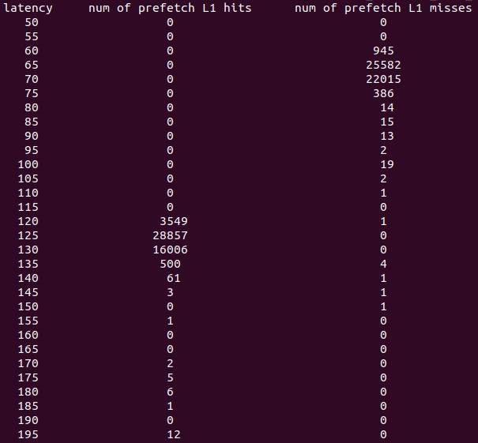

# Adversarial Prefetch: New Cross-Core Cache Side-Channel Attacks
## Description

This repo contains tools to perform Prefetch+Prefetch and Prefetch+Reload.
For details of these two attacks, please refer to our [Oakland'22 paper](https://yananguo.com/files/oakland22.pdf).


## Timing Characterization

To run these two attacks, we need to know the timing threshold to distinguish different cache events. This includes:
prefetch_hit_local_L1 and prefetch_hit_remote_L1 for Prefetch+Prefetch,
load_hit_LLC and load_hit_remote_L1 for Prefetch+Reload.

These thresholds depend on the microarchitecture details of the processor. We provide scripts to find the correct thresholds.

First, to obtain the threshold for Prefetch+Prefetch, do:
```
cd utils
bash get_pre_miss_latency.sh
```
This script tests the latency of the prefetchw when the target data is in the local/remote L1 cahe 50000 times (for each) and prints out the results.

When running this script, you should see something similar with the following image:
<p>

</p>


In the above image, an appropriate timing threshold should be 105-115 cycles (This will be used in the attack).

Similarly, to obtain LLC_S_LATENCY, do:
```
cd utils
bash get_llc_s_latency.sh
```

Then, pick an appropriate timing theshold based on the printed result.

Note that, the timing in the above experiment really depends on the physical distance between the "local" and "remote" core. This can be configured in utils/pre_miss_latency.c and utils/llc_s_latency.c.

In utils/pre_miss_latency.c,
```
//Test the local and remote prefetch latency between core 0 and core 1.
#define trojan_core 0;
#define spy_core 1;
```

In utils/llc_s_latency.c,
```
//Test the LLC and remote L1 load latency between core 0 and core 2. 
#define trojan_core 0;
#define spy_core 2;
#define victim_core 1; // Does not really matter.
```


## Setup and Build the covert channel
TBA.

## Processing the results
TBA.

## Side channel example
TBA.

## Contact

For any questions, please open an issue in this repo or email Yanan (yag45@pitt.edu) directly.


